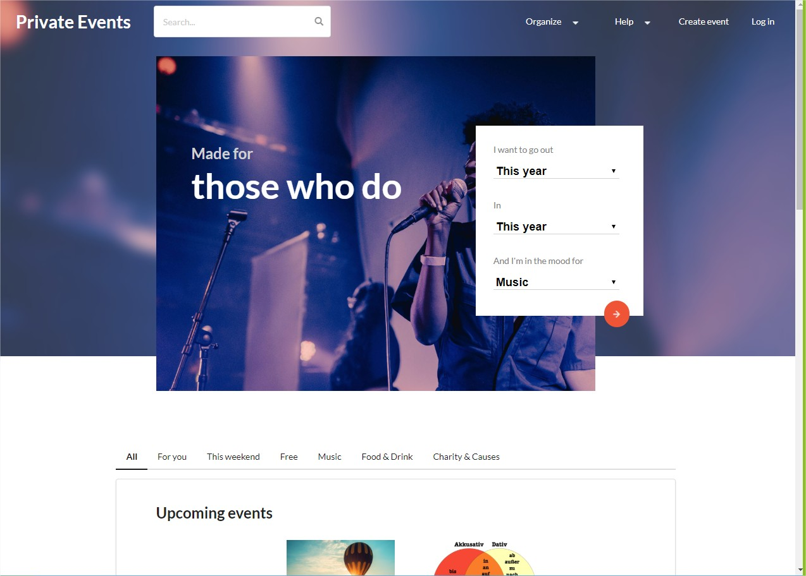

# Private Events

In this app we created a blog where users can create and attend events, similar to [Everbrite](https://www.eventbrite.com/). It has the following functionalities:

- Sign up new user;
- Authenticate user;
- Create new events.

## Preview

- [Live version](https://pure-brook-88318.herokuapp.com/)

## Built with

- HTML 5 (erb);
- CSS 3 (scss);
- Ruby 2.6.3;
- Rails 6.0.1;
- Semantic UI sass.

## Authors

:woman: **Bruna Genz**

- Github: [@bruna-genz](https://github.com/bruna-genz)

:man: **Nicolás Mariño**

- Github: [@nicolasmarino99](https://github.com/nicolasmarino99)
